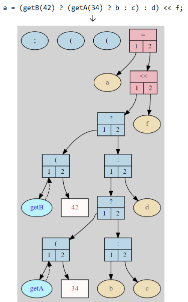

# Cppcheck-visualizer



Cppcheck-visualizer is a tool for visualizing the [AST](https://en.wikipedia.org/wiki/Abstract_syntax_tree) generated by [Cppcheck](https://github.com/danmar/cppcheck). It is probably only of interest for developers of Cppcheck and its addons.

To use Cppcheck-visualizer,  you need [Docker](https://www.docker.com/), as the tool is run inside a container.

## Preparation
Before using the tool, you have to build the Docker image:

```sh
docker build -t viz .
```

## Starting the container

```sh
docker run --rm -ti -v <path-to-your-test-folder>:/test viz /bin/sh
```

You will find your files inside the `/test` folder in the container:
```sh
cd /test
```


## Generating the output
```sh
/viz/convert.sh your-test-file.c
```
You will now have an SVG file called `your-test-file.c.svg` in your test folder.
